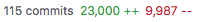
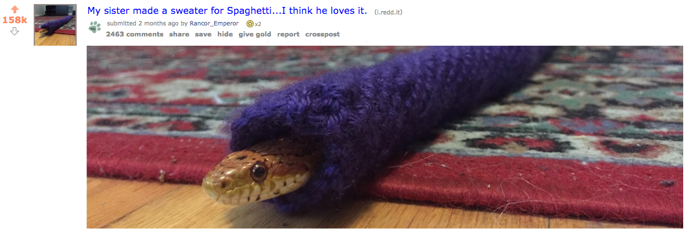
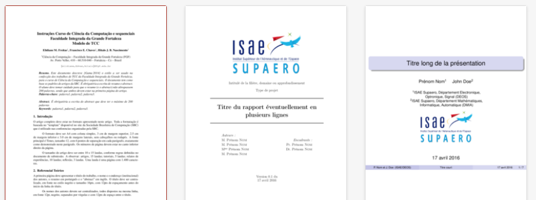
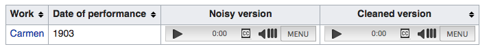
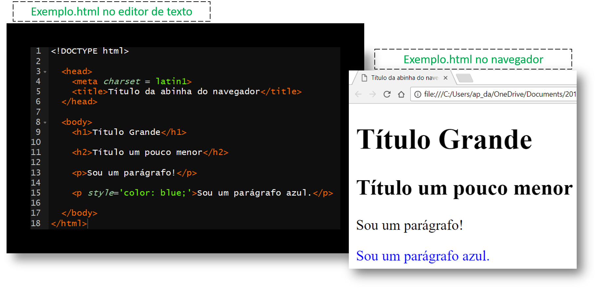
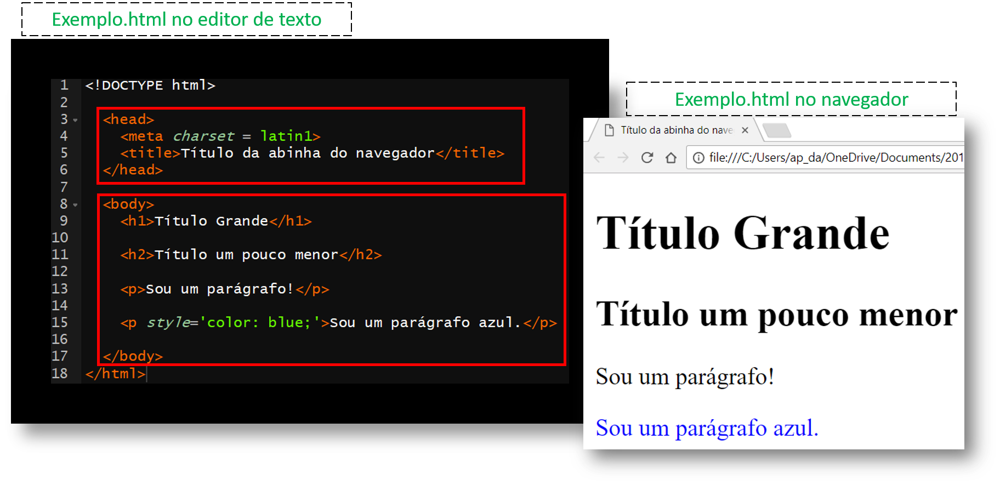
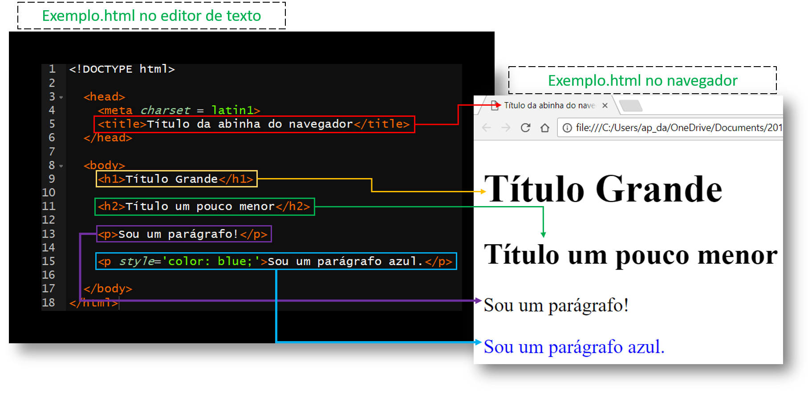

<!-- ### GLOBAIS ########################################################## -->

```{r setup, include=FALSE}
options(htmltools.dir.version = FALSE)
knitr::opts_chunk$set(comment = "#>")
library(magrittr)
```


<!-- ### ABERTURA ######################################################### -->

# Quem Somos

A _Curso-R_:
- O grupo surgiu em 2015 para ministrar o curso "Programação em R: do casual ao avançado" no IME-USP
- Em 2016 e 2017, ministramos novamente o curso e, depois de mais de 100 alunos formados, decidimos aumentar a gama e a frequência das aulas

Julio Trecenti:

- Doutorando em estatística no IME-USP
- Vários cargos
- Convence todo mundo a fazer estatística :D

---
# Prólogo

- Termo mais apropriado: 
    - *web scraping* 
    - "raspagem web"
    - extração de dados provenientes de uma página da internet.

Quando se trata de web scraping, a primeira coisa que precisamos fazer é criar um plano de ação. 

Raspar dados online não é uma ciência exata, então se não nos planejarmos com antecedência é bem provável que no final nosso código fique completamente incompreensível e irreprodutível.

### Expectativa vs. Realidade

```{r, eval = FALSE}
dados <- raspar("site.com")
```

--



---
# Prólogo (cont.)

Por isso recomendamos sempre tentar seguir o **fluxo do web scraping**:


Nós achamos que o fluxo do web scraping é a melhor forma de abordar esse conteúdo
porque, com ele, a tarefa muitas vezes complicada e sem objetivo definido de
raspar dados da web se torna um processo iterativo e bem delimitado que podemos
utilizar nas mais diversas situações.

---
# Conteúdo

Através de exposição, exemplos do mundo real e exercícios veremos cada passo do
fluxo:

- Como **identificar** o objeto de interesse

- Como funciona uma página HTML e como **navegar** por seus elementos

- O protocolo HTTP e como **replicar** seu funcionamento

- Como **parsear** as páginas baixadas

- Como **iterar** ao longo de muitas páginas e como salvar esses resultados

- Como **validar** resultados e evitar os problemas mais comuns

- Outras tecnlogias associadas ao web scraping moderno

- Captchas (quando quebrá-los e como quebrá-los)


<!-- ### IDENTIFICAR ###################################################### -->

---
class: inverse, center, middle
# IDENTIFICAR

---
# Quando usar/não-usar web scraping

### Quando usar:

- Quando precisamos coletar um volume grande de dados da internet

### Quando não usar:

- Quando temos uma forma mais simples de obter os dados (API, base de dados, etc.)

- Quando os termos de uso do site não nos permitem fazer isso

- Quando o `robots.txt` do site não nos permite fazer isso

- Quando houver risco de derrubar ou comprometer a estabilidade do site

- Quando as informações do site não são públicas

---
# Encontrar o que você quer

Imagine que você precisa extair alguma informação de um site, seja ela o título
de várias páginas da Wikipédia, os comentários de um post do Reddit ou mesmo
os dados de países contidos no famosíssimo *Example Web Scraping Website*
([http://example.webscraping.com/](http://example.webscraping.com/)).

Se tivermos verificado que de fato não temos nenhuma outra opção e que o site
nos permite raspá-lo, então podemos começar.

O primeiro passo do fluxo consiste em **identificar** os elementos que queremos
extrair e observar se eles se comportam da mesma forma em todas as situações
possíveis.

### Example Web Scraping Website

O nosso site de exemplo será o `http://example.webscraping.com`. Para que
possamos continuar, precisamos salvar manualmente uma página de interesse desse
site (no caso, a home já basta).

---
# Outros casos interessantes

### Extração de textos

Talvez uma das tarefas mais simples de se cumprir em web scraping é extrair
texto bem-estruturado de uma página. Os artigos da Wikipédia são ótimos para
treinar um primeiro scraper, mas eles acabam sendo uma excessão no mundo do
web scraping justamente por serem tão bem estruturados.

Além disso, a Wikipédia possui uma API.


---
# Outros casos interessantes (cont.)

### Extação de imagens

Baixar imagens já uma tarefa um pouco mais complexa porque elas geralmente estão
menos organizadas que texto e ainda por cima ocupam mais espaço.

A imagem abaixo é do Reddit, que também possui uma API.



---
# Outros casos interessantes (cont.)

### Extração de PDFs

Extrair PDFs é um pouco mais complicado do que extrair imagens porque eles
geralmente não estão endereçados na página da mesma forma que o resto do conteúdo.
Além disso, eles são uma das formas mais pesadas de mídia que podemos raspar.



---
# Outros casos interessantes (cont.)

### Extação de áudio

Dificilmente temos a necessidade de baixar arquivos de áudio, mas, quando esse é
o caso, o fluxo não muda muito em relação aos PDFs. A dificuldade aqui é em como
tratar esses arquivos porque geralmente são escassos os métodos e bibliotecas de
processamento de som.




<!-- ### NAVEGAR ########################################################## -->

---
class: inverse, center, middle
# NAVEGAR


---
# Introdução ao  HTML



HTML (*Hypertext Markup Language*) é uma linguagem de markup cujo uso é a
criação de páginas web. Por trás de todo site há pelo menos um arquivo `.html`.

---

# Introdução ao  HTML (cont.)



Todo arquivo HTML pode ser dividido em seções que definirão diferentes aspectos
da página. `head` descreve "metadados", enquanto `body` é o corpo da página.

---
# Introdução ao  HTML (cont.)



*Tags* (`head`, `body`, `h1`, `p`, ...) demarcam as seções e sub-seções, enquanto
atributos (`charset`, `style`, ...) mudam como essas seções são renderizadas pelo
navegador.

---
# Introdução ao  HTML (cont.)

### Um pouco de teoria:

1) Todo HTML se transforma em um **DOM** (document object model) dentro do navegador.

2) Um DOM pode ser representado como uma árvore em que cada *node* é:
- ou um **atributo**
- ou um **texto**
- ou uma **tag**
- ou um **comentário**

3) Utiliza-se a relação de pai/filho/irmão entre os nós.

4) Para descrever a estrutura de um DOM, usa-se uma linguagem de markup chamada XML
(*Extensible Markup Language*) que define regras para a codificação de um documento.

---
# Introdução ao  HTML (cont.)


---
# Introdução ao  HTML (cont.)


---
# XPath - XML Path Language

Exemplo: coletando todas as tags `<p>` (parágrafos)

```{r}
library(xml2)

# Ler o HTML
html <- read_html("static/html_exemplo.html")

# Coletar todos os nodes com a tag <p>
nodes <- xml_find_all(html, "//p")
nodes

# Extrair o texto contido em cada um dos nodes
text <- xml_text(nodes)
text
```

---
# XPath - XML Path Language (cont.)

Com `xml_attrs()` podemos extrair todos os atributos de um node:

```{r}
xml_attrs(nodes)
```

Já com `xml_children()`, `xml_parents()` e `xml_siblings()` podemos acessar a
estrutura de parentesco dos nós:

```{r}
body <- xml_find_all(html, "body")
xml_siblings(body)
```

---
# CSS

CSS (Cascading Style Sheets) descrevem como os elementos HTML devem se
apresentar na tela. Ele é responsável pela aparência da página.

```{html}
<p style='color: blue;'>Sou um parágrafo azul.</p>
```

O atributo `style` é uma das maneiras de mexer na aparência utilizando CSS. No
exemplo,

- `color` é uma **property** do CSS e 
- `blue` é um **value** do CSS.

Para associar esses pares **properties/values** aos elementos de um DOM, existe
uma ferramenta chamada **CSS selectors**. Assim como fazemos com XML, podemos
usar esses seletores (através do pacote `rvest`) para extrair os nós de uma
página HTML.

---
# CSS (cont.)

Abaixo vemos um `.html` e um `.css` que é usado para estilizar o primeiro. Se os
nós indicados forem encontrados pelos seletores do CSS, então eles sofrerão
as mudanças indicadas.


---
# Seletores CSS vs. XPath

> "OK, legal, podemos usar o CSS e o XPath para encontrar nós em um página, mas
por que usar um ou outro"

A grande vantagem do XPath é permitir que acessemos os filhos, pais e irmãos de um
nó. De fato os seletores CSS são mais simples, mas eles também são mais limitados.

O bom é que se tivermos os seletores CSS, podemos transformá-los sem muita
dificuldade em um query XPath:

- Seletor de tag: `p` = `//p`
- Seletor de classe: `.azul` = `//*[@class='azul']`
- Seletor de id: `#meu-p-favorito` = `//*[@id='meu-p-favorito']`

Além disso, a maior parte das ferramentas que utilizaremos ao longo do processo
trabalham preferencialmente com XPath.

---
# Seletores CSS vs. XPath (cont.)

```{r}
html <- read_html("static/html_exemplo_css_a_parte.html")
xml_find_all(html, "//p")
xml_find_all(html, "//*[@class='azul']")
```

Note que `//p` indica que estamos fazendo uma busca na tag `p`, enquanto `//*`
indica que estamos fazendo uma busca em qualquer tag.

---
# Encontrando o XPath

Para os iniciantes no mundo do web scraping, existem ferramentas muito
convenientes que nos ajudam a encontrar o XPath (ou CSS Selector) de uma
estrutura da página.

A primeira delas se chama **CSS Selector Gadget**, enquanto a segunda está
embutida no próprio Chrome.

### Vamos ao Chrome...

???
PROPONHO QUE AQUI PAREMOS E ENCONTREMOS TODOS OS XPATH NECESSÁRIOS PARA
A ANÁLISE DO EXAMPLE WEBSCRAPING WEBSITE

---
# Inspect

Como acabamos de ver, a ferramenta de inspeção do Chrome (ou de qualquer outro
navegador moderno) é nossa grande aliada na hora de encontrar os elementos
que desejamos extrair quando raspando uma página.


<!-- ### REPLICAR ######################################################### -->

---
class: inverse, center, middle
# REPLICAR

---
# Web

Até agora já aprendemos que um site não passa de uma coleção de arquivos
que os navegadores são capazes de renderizar. Entendemos também como é a
arquitetura básica desses arquivos e como podemos extrair informações destas
estruturas.

Agora nos resta entender como funciona a rede que nos traz tais arquivos.
Veremos que não é necessário ter um navegador para acessar um site,
característica da qual tiraremos vantagem para poder coletar todas as
páginas das quais precisamos.

---
# Protocolo HTTP

O HTTP (Hypertext Transfer Protocol) é um protocolo de aplicações para sistemas
de informação distribuídos e colaborativos. Este protocolo é, no fundo, a base
de toda a web<sup>*</sup> pois ele permite a troca e transferência de
arquivos hipertexto.


???
Web não é a mesma coisa que internet. A internet é uma rede mundial e
descentralizada de computadores, enquanto a web é um protocolo que nos
permite acessar documentos em hipertexto através da infraestrutura da
internet

---
# Métodos HTTP

O protocolo HTTP na verdade é composto por diversos **métodos** que chamam
páginas páginas hipertexto de servidores web. Os métodos mais comuns são
`GET` e `POST`

--

## Pacote httr

Em R, o pacote `httr` é o que faz a ponte de comunicação entre nossas requisições e as respectivas respostas.

- Serve para mexer com requisições/respostas HTTP e URLs.
- As principais funções são os métodos do protocolo `http`: GET, POST, content, cookies, write_disk, status_code.

---
### GET

O método `GET` é o mais simples. Ele permite chamar uma página da internet e
especificar todos os parâmetros de seu URL.

```{r}
library(httr)

# GET sem nenhum parâmetro
get_1 <- GET("https://httpbin.org/get")

# GET equivalente a https://httpbin.org/cookies/set?meu-cookie=1
params <- list("meu-cookie" = 1)
get_2 <- GET("https://httpbin.org/cookies/set", query = params)
```

---
# Métodos HTTP (cont.)

### POST

O método `POST` é muito semelhante ao `GET`, mas ele permite enviar pacotes
carregados de informações para a página (ao invés de apenas adicionar parâmetros
à chamada).

```{r}
library(httr)

# POST sem nenhum form
post_1 <- POST("https://httpbin.org/post")

# POST equivalente a https://httpbin.org/get?show_env=1
form <- list(
  "um-numero" = 1,
  "uma-letra" = "a",
  "uma-data" = "2018-01-01")
post_2 <- POST("https://httpbin.org/post", body = form)
```

???
As chamadas POST podem ter diferentes encodings determinados pelo servidor.
Isso é um parâmetro muito simples na chamada, mas foge do escopo desta aula.

---
# Responses

Nos últimos slides vimos chamadas HTTP, mas não vimos os seus resultados. Cada
uma destas chamadas retorna aquilo que chamamos de **response**, uma resposta
que contém metadados importantes e (mais relevante no nosso caso) o código HTML
para renderizar a página requisitada.

### Status

Status é um verificador simples de se a chamada deu certo. Um status igual a 200
geralmente indica que não houve nenhum erro ("OK"); 401 indica "Não Autorizado",
404 indica "Não Encontrado", 500 indica "Erro Interno Do Servidor" e assim por
diante.

418 indica "Sou Um Bule De Chá".

```{r}
get_1$status_code
```

---
# Responses (cont.)

### Cookies

Cookies são pequenos rastreadores que informam ao servidor que você passou por
uma determinada parte do site. Eles se tornam importantes quando queremos fingir
para o site que o nosso scraper já cumpriu um certo passo da navegação.

```{r}
get_2$cookies
```

---
# Responses (cont.)

### Content

Este é o nosso objeto de interesse. Ele é o conteúdo HTML da página requisitada!

--

### Pacote xml2

Uma vez com o HTML em mãos, é usando o pacote `xml2` que extraímos as informações que precisamos.

- Esse pacote fornece uma interface simples e consistente para trabalhar com HTML/XML.
- Suas principais funções são read_html, xml_find_all, xml_attrs, xml_text, xml_children, xml_parents, xml_siblings

---

## ler um html

Se usarmos `read_html()` e as funções de XML que vimos anteriormente, podemos
começar a extrair importantes dados da página.

```{r}
read_html(post_1)
read_html(post_2)
```

???
Notar como existe uma diferença no elemento `form` dos dois HTMLs. Isso foi
exatamente o pacote enviado através do parâmetro `body` de `POST`.

---
# Content

Talvez mais fácil do que tentar ler o HTML retornado na response seja salvar o
HTML em um arquivo e aí abrir este arquivo. Isso nos dá uma noção muito melhor
do que recebemos de volta e é uma parte essencial do processo do web scraping.

```{r}
post_2 <- POST(
  "https://httpbin.org/post", body = form,
  write_disk("static/post.html", overwrite = TRUE))
read_html("static/post.html")
```

Clicando duas vezes no arquivo ou rodando a função `BROWSE()` abrimos ele em
um navegador para que possamos investigar de perto se está tudo em ordem.

```{r, eval = FALSE}
BROWSE("static/post.html")
```

---
# Content

### Vale a pena saber...

O `content` de uma `response` pode ser virtualmente qualquer tipo de arquivo. Geralmente é um HTML e por isso usamos a função `read_html()` para acessar o conteúdo, mas usa-se a função `httr::content()` para acessar os contents de modo geral.

```{r, eval=FALSE}
httr::content(post_1)
```


---
# Network

A última ferramenta que demonstraremos do Chrome é a função de análise de
**networking**. Com ela podemos acompanhar todas as chamadas HTTP que são feitas
pela página, nos permitindo analisá-las de modo a reproduzí-las através do R.

### Vamos ao Chrome...

???
PROPONHO QUE AQUI PAREMOS E ANALISEMOS TODO O NETWORKING DO EXAMPLE WEBSCRAPING
WEBSITE DE FORMA QUE TODOS JÁ CONSIGAM BAIXAR TODAS AS PÁGINAS DESEJADAS.


<!-- ### PARSEAR ########################################################## -->

---
class: inverse, center, middle
# PARSEAR

---
# Parsear

- Definição de "Parsear"

---
# Parsear

### Exercício 1

O site [http://example.webscraping.com/](http://example.webscraping.com/) contém uma série de links que possuem informações sobre países. 

Construa um `data.frame` com as colunas `pais` e `link` dos dez primeiros países que aparecem na primeira página.


---
# Parsear

### Exercício 1 - GABARITO

O site [http://example.webscraping.com/](http://example.webscraping.com/) contém uma série de links que possuem informações sobre países. 

Construa um `data.frame` com as colunas `pais` e `link` dos dez primeiros países que aparecem na primeira página.

```{r, warning=FALSE, message=FALSE}
url <- "http://example.webscraping.com/"
paises <- url %>%
  httr::GET() %>%
  httr::read_html() %>%
  xml2::xml_find_all('//table//a') %>%
  tibble::tibble(node = .) %>%
  dplyr::mutate(pais = xml2::xml_text(node),
                attrs = xml2::xml_attr(node, "href"))
```

---
# Parsear

### Exercício 2

A partir do objeto `paises` gerado no exercício 1 crie uma coluna `img_src` que guarde o atributo `src` das tags `` (ele é local onde a imagem da bandeira está disponível).

---
# Parsear

### Exercício 2 - GABARITO

A partir do objeto `paises` gerado no exercício 1 crie uma coluna `img_src` que guarde o atributo `src` das tags `` (ele é local onde a imagem da bandeira está disponível).


```{r}
paises <- paises %>%
  mutate(img_src = xml_find_all(node, "img") %>% xml_attr("src"))
```

---
# Parsear

### Exercício 3

No navegador, inspecione o [http://example.webscraping.com/](http://example.webscraping.com/) e identifique uma tabela no corpo do site. Em seguida, utilize a função `html_table()` do pacote `rvest` e compare o resultado com o observado no inspetor. Qual conteúdo a função devolveu: tag, texto ou atributos?

---
# Parsear

### Exercício 3 - GABARITO

No navegador, inspecione o [http://example.webscraping.com/](http://example.webscraping.com/) e identifique uma tabela no corpo do site. Em seguida, utilize a função `html_table()` do pacote `rvest` e compare o resultado com o observado no inspetor. Qual conteúdo a função devolveu: tag, texto ou atributos?

```{r}
library(rvest)
tabela <- url %>%
  GET() %>%
  read_html %>%
  html_table()
```

O `html_table()` retorna o texto das células.

---
# Download

Dentro da sua request (POST ou GET) use a função `write_disc()`. Por meio desta função você especifica que você gostaria de guardar o conteúdo (`content`) da resposta (`response`) em um arquivo externo.

Exemplo: baixando a imagem de uma bandeira.

```{r}
url_img <- paste0(url, paises$img_src[1])
url_img

img <- GET(url_img, write_disk("teste.png", overwrite = TRUE))
```

---
# Download

Também há a possibilidade de salvar um `content` a qualquer momento.

```{r}
img <- GET(url_img)

img %>% httr::content() %>% png::writePNG("teste2.png")
```

A função `content` retorna o conteúdo de uma dada `response`. 
OBS: No caso o conteúdo era um `png`, por isso utilizamos o `writePNG()` pra guardar o conteúdo.


---
class: inverse, center, middle
# BREAK (15 minutos)

---
# Tidy Output

Até o momento apenas extraímos o conteúdo das páginas e aprendemos a baixa-las, mas saber deixar esse conteúdo arrumadinho também é muito importante. Uma tabela em `html` extraída com `html_table` é muito legal, mas existem jeitos mais legais de guardar informação.

---
# Jeitos de guardar a mesma informação

## Jeito 1

```{r, eval = FALSE}
preg <- read.csv("preg.csv", stringsAsFactors = FALSE)
preg
#>           nome      reais    dolares
#> 1         João         NA         18
#> 2        Maria          4          1
#> 3        Pedro          6          7
```

--

## Jeito 2

```{r, eval = FALSE}
#>       moeda       João    Maria        Pedro
#> 1     reais         NA        4            6
#> 2   dolares         18        1            7
```

---
# Tidy data

Toda tabela é um conjunto de **valores** e, por sua vez, cada **valor** pertence a uma **variável** e a uma **observação**.

--

1. **observações** são as entidades de onde se tomam medidas, como por exemplo as pessoas da nossa tabela.
2. **variáveis** são tipos de medidas que podem ser extraídas de uma observação

```{r, eval = FALSE}
#>           nome     moeda  quantidade
#> 1        Maria     reais           4
#> 2        Maria     dolares         1
#> 3         João     reais          NA
#> 4         João     dolares        18
#> 5        Pedro     reais           6
#> 6        Pedro     dolares         7
```

---
# Tidy data

Uma base é dita `tidy` quando:

1. Cada **variável** forma uma coluna.
2. Cada **observação** forma uma linha.
3. Cada tipo de observação forma uma tabela

--

## Tipo comum de base bagunçada
```{r, eval = FALSE}
#>    religion      `<$10k` `$10-20k` `$20-30k` `$30-40k` `$40-50k` `$50-75k`
#>    <chr>           <int>     <int>     <int>     <int>     <int>     <int>
#>  1 Agnostic           27        34        60        81        76       137
#>  2 Atheist            12        27        37        52        35        70
#>  3 Buddhist           27        21        30        34        33        58
#>  4 Catholic          418       617       732       670       638      1116
#>  6 Evangelical …     575       869      1064       982       881      1486
#> # ... with 8 more rows, and 4 more variables: `$75-100k` <int>,
#> #   `$100-150k` <int>, `>150k` <int>, `Don't know/refused` <int>
```

---
# Tidy data

Versão arrumada:

```{r}
#>    religion                income frequency
#>    <chr>                   <chr>      <int>
#>  1 Agnostic                <$10k         27
#>  2 Atheist                 <$10k         12
#>  3 Buddhist                <$10k         27
#>  4 Catholic                <$10k        418
#>  5 Don’t know/refused      <$10k         15
#>  6 Evangelical Prot        <$10k        575
```

---
# Mão na Massa

Exercício 4:

1. Crie uma conta manualmente e depois construa uma função para se logar.
2. Faça uma requisição que baixa a página de Andorra.
3. Extraia os dados de andorra numa tabela `tidy`.

<!-- ### ITERAR ########################################################### -->

---
class: inverse, center, middle
# ITERAR

---
# O que significa "iterar"

Iterar nada mais é que do que repetir um comportamento várias vezes para parâmetros
ligeiramente diferentes. Em computação geralmente falamos em "iterar em uma lista"
por exemplo, mas nesse caso vamos estar iterando ao longo das páginas as quais
desejamos baixar.

```{r}
i <- 1
v <- 1:15
while (i <= length(v)) {
  v[i] <- v[i] + 5
  i <- i + 1
}
v
```

Precisamos fazer isso porque geralmente vamos querer que o scraper puxe várias páginas
semelhantes de um mesmo site, logo, precisamos automatizar esse processo iterativo.

---

# Salvar Tidy output

Vale a pena extrair as coisas no format `tidy` por vários motivos.

--

1. Vai ser mais fácil analisar os dados.

--

2. Vai ser mais fácil juntar os dados.

--

Mas também existem outros cuidados que você pode ter na hora de repetir uma requisição várias vezes:

--

1. Salve resultados parciais.

2. Deixe tudo o mais `tidy` o possível.

3. Use a função `abjutils::pvec`.

---
# Iteração - Básico

Existem algumas maneiras de iterar uma função que faz _scraping_

1. Funções como `purrr::walk`, `sapply`, etc

  - Não monta outra função, mas também não paraleliza nem trata erros

--

2. `for` e `while`

  - Lida um pouco melhor com erros, mas vai precisar de outros pacotes para paralelizar

---
# Exemplo de for

```{r, eval = FALSE}

for(i in 1:10){
  httr::GET(
    paste0('http://example.webscraping.com/places/default/view/',i)
  )
}

```

O loop acima não tem muito mistério. Para cada `i` estamos estamos aplicando a
função `GET`, mudando o URL da requisição; o resultado é que em cada passada
do loop, vamos estar pegando uma página do índice do site.

---

# pvec

Web scraping é difícil porque, lá no fundo, estamos fazendo uma engenharia reversa...

--

...e fazendo isso **MUITA** coisa pode dar errado.

--

Para remediar isso, criamos uma função que faz três coisas:

1. Itera o mesmo resultado várias vezes (vetoriza)

2. Não trava a função se der erro

3. Paraleliza

---

# pvec (cont.)

```{r, erro = FALSE, warning=FALSE, message = FALSE}
pad <- function(str, b = "", a = "") paste0(b, str, a) 
abjutils::pvec(LETTERS, pad, 
               b = "123", a = "321", 
               .cores = 4, 
               .flatten = TRUE)
```

---

# Exercício 5

Baixe as páginas de todos os países


<!-- ### VALIDAR ########################################################## -->

---
class: inverse, center, middle
# VALIDAR

---

# Validação

Um dos passos mais importantes do web scraping é verificar se a requisição que fizemos retornou exatamente o que queríamos. 

--

Entretanto, existem algumas características comuns a muitos websites que dificultam essa parte do trabalho

--

Alguns sites bloqueiam IP's, enquanto outros, construídos em `.NET` ou renderizando parte do conteúdo em `javascript`, precisam de mais do que um simples `POST` para chegar onde queremos.

---

# Bloqueio de IP

Web scraping, por fazer um monte de requisições automáticas, é um inimigo comum dos administradores de websites. Existem várias formas de _desincentivar_ o acesso automático, e o mais comum deles é o bloqueio de IP. 

--

A solução mais simples para o bloqueio de IP, que resolve um problema tanto do usuário quanto do servidor, é inserir uma pausa entre um download e outro. Em R, isso é feito usando a função `sleep`

--

```{r, eval = FALSE}
for(i in 1:10){
  
  httr::GET(
    paste0('http://example.webscraping.com/places/default/view/', i)
  )
  
  sleep(1)
}
```

---
# Event validation e view state

Sites feitos em `.NET` (os `.aspx` espalhados pela internet) muitas vezes usam parâmetros esquisitos nas requisições `POST`

--

Esses parâmetros não significam nada em particular, mas são importantes para que as requisições funcionem corretamente.

--

Isso acontece, por exemplo [neste site](http://www.ssp.sp.gov.br/Estatistica/Pesquisa.aspx).

```{r, eval = FALSE}
view_state <- r %>%
  xml2::read_html() %>%
  rvest::html_nodes("input[name='__VIEWSTATE']") %>%
  rvest::html_attr("value")

event_validation <- r %>%
  xml2::read_html() %>%
  rvest::html_nodes("input[name='__EVENTVALIDATION']") %>%
  rvest::html_attr("value")
```

---
class: inverse, center, middle

# MISCELÂNEA

---
# Paralelização e Distribuição

### Paralelização

Já aprendemos anteriormente a função `abjutils::pvec()`, que permite a execução
em paralelo de múltiplos downloads. Isso é possível porque, na realidade,
o computador passa muito tempo da raspagem esperando o servidor entregar os
arquivos necessários pra ele; esse tempo pode ser utilizado para começar
a raspagem de outras páginas.

O motor por trás da `pvec` é a função `future_map()` do pacote `furrr`:

```{r}
#> Unit: seconds
#>          expr      min     mean   median      max
#>  com_paralelo 1.831117 1.913419 1.906115 2.012591
#>  sem_paralelo 3.249223 3.374113 3.375318 3.498316
```

Para tirar mais vantagem disso, podemos por exemplo alugar máquinas na GCP
ou na AWS que tenham mais núcleos, possibilitando um grau maior de paralelismo.

---
# Paralelização e Distribuição (cont.)

### Distribuição

... No entando, uma única máquina com muitos núcleos de processamento terá
um gargalo no acesso a disco, ou seja, ela não conseguirá escrever todos
os arquivos que queremos salvar em seu disco rígido com eficiência suficiente.

Por isso, podemos sincronizar várias máquinas virtuais para criar o que
chamamos de *web scraper distribuído*.

---
### Distribuição (cont.)


---
# CAPTCHAs

Quebrar CAPTCHAs muitas vezes se faz necessário quando raspando uma página da
web. Existem muitas formas de fazer isso, desde pagar acessos para o
*Death By Captcha* até criar os seus próprios modelos de visão computacional;
aqui vamos falar de algumas das formas mais simples e eficazes.

### Lendo a imagem

```{r, echo = FALSE, message = FALSE}
library(stringr)
library(png)
library(magick)
library(base64enc)
pag_signup <- paste0(
  "http://example.webscraping.com/",
  "places/default/user/register?_next=/places/default/index")
```

```{r}
pag_signup %>%
  GET() %>%
  read_html() %>%
  xml_find_first("//*[@id='recaptcha']//img") %>%
  xml_attr("src") %>%
  str_remove("data:image/png;base64,") %>%
  base64decode() %>%
  readPNG() %>%
  writePNG("static/captcha.png")
```

---
# CATPCHAs (cont.)

### Tratando imagens com magick


```{r}
"static/captcha.png" %>%
  image_read() %>%
  image_transparent("green", fuzz = 20) %>%
  image_transparent("blue", fuzz = 50) %>%
  image_transparent("red", fuzz = 50) %>%
  image_transparent("white", fuzz = 50) %>%
  image_quantize(2) %>%
  image_write("static/captcha_clean.png")
```

---
# CATPCHAs (cont.)

### Lendo o texto com tesseract


```{r}
"static/captcha_clean.png" %>%
  image_read() %>%
  image_background("white") %>% 
  image_ocr()
```

Muitas vezes pode ser necessário tratar ainda mais a imagem antes de passar o OCR.
Para melhorar o acerto, tente aumentar, diminuir, filtrar as cores, borrar,
desborrar, reduzir o barulho...

---
# CATPCHAs (cont.)

### Decryptr

Quando temos que lidar com imagens mais complicadas que as dos slides anteriores
(principalmente quando as letras desejadas não estão em preto), pode ser que
precisemos criar um modelo de *deep learning* para quebrar os CAPTCHAs.

Ensinar modelos desse tipo está fora do escopo da aula, mas nós criamos um pacote
que já vem carregado com alguns modelos pré-prontos. Ele também pode te ajudar a
criar seus próprios modelos.


```{r, echo = FALSE}
arq <- "static/captcha10f4c43cd3747.png"
```

```{r, message=FALSE, warning=FALSE, eval = FALSE}
decrypt(arq, model = "rfb")
```

---
class: inverse, center, middle
# OBRIGADO
